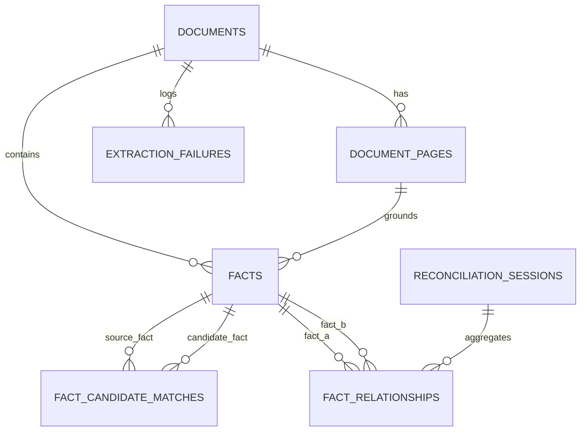

# FactLens Architecture & Design Document

> **Evidence-grounded cross-document fact intelligence**

---

## 1. Executive Overview

**FactLens** is an automated Fact Knowledge Layer and enterprise intelligence platform designed to extract, ground, compare, and reconcile atomic factual claims across arbitrary PDF documents. 

Rather than treating documents as black boxes or opaque context windows, FactLens extracts structured semantic facts with verifiable provenance (document ID, page number, verbatim quote, coordinate bounding boxes), standardizes measurements (currencies, units, temporal periods), indexes embeddings in a local vector database, and executes multi-dimensional candidate matching and deterministic cross-document reconciliation.

---

## 2. End-to-End Pipeline Architecture

```
PDF Document
 ↓
PyMuPDF (fitz) [DETERMINISTIC]
 ↓
Document Pages & Text Layout Blocks [DETERMINISTIC]
 ↓
Structured Fact Extraction (LLM / Mock Provider) [LLM / EXTRACTOR]
 ↓
Evidence Grounding Verification [DETERMINISTIC]
 ↓
Deterministic Normalization & Context Enrichment [DETERMINISTIC]
 ↓
SQLite Storage & Metadata Persistence [DETERMINISTIC]
 ↓
Local Embeddings (SentenceTransformers all-MiniLM-L6-v2) [DETERMINISTIC]
 ↓
Persistent ChromaDB Vector Store [DETERMINISTIC]
 ↓
Multi-Dimensional Candidate Matching [DETERMINISTIC]
 ↓
Deterministic 4-Way Reconciliation Core [DETERMINISTIC]
 ↓
FastAPI Backend REST Layer [DETERMINISTIC]
 ↓
React 18 + TypeScript Enterprise SaaS UI [DETERMINISTIC]
```

---

## 3. Deterministic vs LLM Execution Breakdown

| Pipeline Stage | Mechanism | Nature | Justification & Safeguards |
|---|---|---|---|
| **1. PDF Ingestion & Parsing** | PyMuPDF (`fitz`) | **Deterministic** | Extracts exact text characters, font sizes, line blocks, and `[x0, y0, x1, y1]` coordinates. Computes SHA-256 hash. |
| **2. Fact & Statement Extraction** | Google Gemini / OpenAI / Mock Provider | **LLM-Assisted** | Parses unstructured narrative text into structured candidate statements with entity, metric, raw value, and candidate quote. |
| **3. Evidence Grounding Verification** | Exact Substring & Spatial Verifier | **Deterministic** | Validates that extracted quote exists verbatim in source page text. Discards or flags ungrounded hallucinations as `UNCERTAIN`/`FAILED`. |
| **4. Normalization Engine** | Regex Tokenizer & Canonical Parsers | **Deterministic** | Standardizes numbers, units, ISO currencies, fiscal periods, and multipliers (`lakh`, `crore`, `million`, `billion`). |
| **5. Semantic Embedding** | `sentence-transformers/all-MiniLM-L6-v2` | **Deterministic** | Encodes fact statements into 384-dimensional dense vectors offline without cloud dependencies. |
| **6. Vector Storage & Retrieval** | Persistent ChromaDB | **Deterministic** | Computes cosine distance and filters by metadata in local storage. |
| **7. Candidate Compatibility Scoring** | Multi-Dimensional Scorer | **Deterministic** | Evaluates 7 dimensions: Semantic (cosine), Entity (fuzzy/exact), Attribute synonyms, Period, Scope, Geography, and Currency. |
| **8. 4-Way Cross Reconciliation** | Context-First Arithmetic Analyzer | **Deterministic** | Evaluates context compatibility, tolerance thresholds ($\Delta \le 1.0\%$), and produces explainable arithmetic diffs. |
| **9. Edge-Case Disambiguation** | Constrained Structured LLM Fallback | **LLM-Assisted (Optional Fallback)** | Invoked only for ambiguous qualitative definitions; strictly constrained to valid ontology outputs. |
| **10. UI & Audit Visualization** | React + TypeScript SaaS UI | **Deterministic** | Renders live database state, comparison matrices, dual evidence quotes, and audit logs. Zero mock data in production views. |

---

## 4. Key Components & Services

### 4.1 PDF Grounding & Extraction Engine (`backend/app/services/pdf_service.py`)
- Ingests arbitrary multi-page PDFs without hardcoded schema limitations.
- Computes SHA-256 document checksums to ensure integrity and deduplication.
- Extracts text page-by-page preserving visual layout blocks and exact coordinates `[x0, y0, x1, y1]` for bounding box grounding.

### 4.2 Fact Normalization Engine (`backend/app/services/normalization_service.py`)
- Standardizes diverse surface representations into canonical machine-comparable formats while **strictly preserving original raw surface text**:
  - **Numerical & Scaled Values**: `"$383.29 billion"` $\rightarrow$ `383290000000.0`, `"₹8,142 Cr"` $\rightarrow$ `81420000000.0`, `"1.4 million"` $\rightarrow$ `1400000.0`.
  - **Negative Values**: Supports parenthetical financial notation `(₹8,142 Cr)`, `($50M)`, and negative percentages `-2.5%`.
  - **Scale Multipliers**: Supports `k`, `thousand`, `million`, `billion`, `trillion`, Indian `lakh` (`1e5`), and `crore` (`1e7`).
  - **Currencies**: Isolated extraction for `USD` (`$`), `INR` (`₹`, `Rs`), `EUR` (`€`), `GBP` (`£`), `JPY` (`¥`).
  - **Zero Implicit Currency Conversion**: Currency remains an intrinsic contextual constraint. ₹100 and $100 are strictly non-interchangeable without an explicit user-configured conversion layer.
  - **Temporal Normalization**: Standardizes `FY2023`, `FY24`, `FY2025`, `Q1-Q4` quarters (e.g. `2023-Q4`), and exact ISO dates (`YYYY-MM-DD`).

### 4.3 Semantic Embedding Service (`backend/app/services/vector/embeddings.py`)
- **Local Execution**: Uses `sentence-transformers` with model `all-MiniLM-L6-v2` (384 dimensions). Runs fully offline with zero mandatory third-party API dependencies.
- **Graceful Fallback**: Implements deterministic pseudo-semantic vector hashing if PyTorch/transformer models are unavailable.
- **Contextual Fact Embedding**: Constructs rich semantic strings combining entity, attribute, value, period, and statement.

### 4.4 Vector Store (`backend/app/services/vector/chroma_store.py`)
- In-process persistent **ChromaDB** vector store under `./data/vector_store/`.
- Indexes one vector per fact with structured metadata (`fact_id`, `document_id`, `entity`, `attribute`, `time_period`, `fiscal_year`, `quarter`, `geography`, `currency`, `unit`, `status`).

### 4.5 Candidate Retrieval & Multi-Dimensional Compatibility Scoring (`backend/app/services/comparison_service.py`)
- Retrieves top-K candidates from ChromaDB, excludes self-matches, and calculates multi-dimensional compatibility scores across 7 dimensions (Semantic, Entity, Attribute, Time, Scope, Geography, Currency).

### 4.6 Cross-Document Reconciliation Engine (`backend/app/services/reconciliation_service.py`)
- **Deterministic 4-Way Classifier**:
  - `CORROBORATED`: Same entity, attribute, time period, scope, currency, and numerical values agree within tolerance ($\le 1\%$).
  - `CONTRADICTED`: Same context, but numerical values materially diverge ($> 1\%$). Produces explicit arithmetic difference breakdowns.
  - `CONTEXTUALLY_DIFFERENT`: Differences attributable to reporting scope (Consolidated vs Standalone), distinct time periods (FY2023 vs FY2024), reporting basis (Actual vs Forecast), or different currencies (INR vs USD). Context takes strict precedence over numerical comparison.
  - `UNCERTAIN`: Triggered when evidence is ungrounded, numeric values are unparseable, or entity/metric definitions are ambiguous.
- **Deterministic Value Comparison Engine**:
  $$\text{Relative Difference} = \frac{|V_A - V_B|}{\max(|V_A|, |V_B|)}$$
  $\text{MATCH\_TOLERANCE} = 0.01$ ($1\%$), $\text{POSSIBLE\_MATCH\_TOLERANCE} = 0.05$ ($5\%$).
- **Evidence Provenance Guarantee**: Every reconciliation preserves document IDs, filenames, page numbers, and verbatim quotes from both source and candidate facts. Evidence is never fabricated or rewritten.

---

## 5. Database Schema


